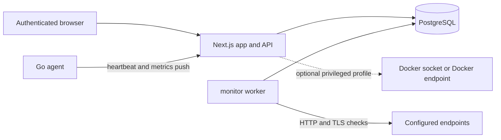

# DevSecOps Dashboard

DevSecOps Dashboard is a self-hosted infrastructure monitoring dashboard for Linux hosts, Docker containers, HTTP endpoints, SSL certificates, alerts, and audit logs.

> Project maturity: this is a working MVP, not a hardened 1.0 release. It is suitable for self-hosted evaluation and contribution, but operators should review the security model, deployment docs, and configuration before exposing it to a network.

## Implemented Features

- Email/password dashboard login with role-aware server-side guards.
- Linux host heartbeat and metrics ingestion from a Go agent.
- Server inventory, metrics charts, endpoint checks, SSL certificate checks, alerts, and audit logs.
- Container inventory and guarded container actions when Docker access is explicitly configured.
- Prisma/PostgreSQL persistence with migrations and seed support.
- Docker Compose deployment files, health checks, preflight validation, and CI.

## Planned Or Incomplete

- User and role management UI.
- Notification channels for alerts.
- Public/read-only status page.
- Signed release artifacts and formal release automation.
- Broader packaging beyond Docker Compose.

## Architecture



See [docs/architecture.md](docs/architecture.md) for component and trust-boundary details.

## Secure Quickstart

Requirements:

- Node.js 22 or newer
- npm
- Docker and Docker Compose
- Go 1.22 or newer only for agent development

Generate local configuration:

```bash
npm ci
npm run setup
npm run preflight
```

Start a development stack:

```bash
docker compose -f docker-compose.yml -f docker-compose.dev.yml up -d --build
```

Open the dashboard at the `AUTH_URL`/`APP_PORT` you configured, commonly:

```text
http://localhost:3003
```

Production uses the base Compose file:

```bash
docker compose up -d --build
```

Production defaults fail closed for required secrets, keep PostgreSQL private to the Compose network, disable private-network endpoint monitoring, disable Docker socket access, run migrations before startup, and skip seed data unless `RUN_DATABASE_SEED=true`.

## Screenshots

Screenshots are not included yet. Do not add generated or unrelated screenshots; only add current screenshots captured from the working application.

## Supported Deployment Model

The supported deployment model is Docker Compose on a Linux host:

- `docker-compose.yml`: production-safe base.
- `docker-compose.dev.yml`: local development override with a published database port and homelab-friendly private monitoring.
- `docker-compose.docker-socket.yml`: explicit privileged Docker socket override/profile.

See [docs/deployment.md](docs/deployment.md).

## Agent Overview

The Go agent uses outbound push:

```text
agent -> dashboard /api/agents/heartbeat
agent -> dashboard /api/agents/metrics
```

The agent requires `DASHBOARD_URL`, `AGENT_ID`, and `AGENT_SECRET`; placeholder credentials are rejected. See [docs/agent-installation.md](docs/agent-installation.md).

## Security Model

- Dashboard users authenticate through NextAuth credentials.
- Agent tokens are hashed in the database and validated with timestamp, nonce, and request-body hash checks.
- Endpoint monitoring supports only HTTP and HTTPS.
- Private, loopback, link-local, and unique-local targets are blocked by default.
- Cloud metadata addresses stay blocked even when private-network monitoring is enabled.
- Redirect targets are revalidated before each fetch.
- DNS rebinding cannot be fully eliminated by application checks; run the worker in a network context appropriate for the endpoints you trust.
- Docker socket access is host-equivalent and disabled by default.

See [SECURITY.md](SECURITY.md) and [docs/configuration.md](docs/configuration.md).

## Documentation

- [Architecture](docs/architecture.md)
- [Deployment](docs/deployment.md)
- [Configuration](docs/configuration.md)
- [Agent installation](docs/agent-installation.md)
- [Upgrading](docs/upgrading.md)
- [Troubleshooting](docs/troubleshooting.md)
- [Maintainer GitHub settings](docs/maintainer/github-settings.md)
- [Contributing](CONTRIBUTING.md)

## Development

```bash
npm ci
npm run setup
docker compose -f docker-compose.yml -f docker-compose.dev.yml up -d postgres
npm run prisma:deploy
npm run prisma:seed
npm run dev -- -p 3003
```

Validation:

```bash
npm run lint
npm run typecheck
npm test
npm run build
cd agent && go test ./...
docker compose config
docker build --target runner -t devsecops-dashboard:local .
```

## Roadmap

Near-term work should focus on:

- cleaner user and role administration;
- alert notification channels;
- release packaging and signed artifacts;
- expanded tests around authorization and Docker safety;
- better UI flows for sensitive container actions.

## License

Apache-2.0. See [LICENSE](LICENSE).
