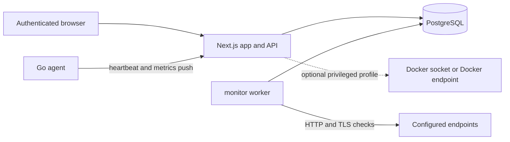

# Architecture

DevSecOps Dashboard is a self-hosted monitoring dashboard with a Next.js application, PostgreSQL database, background monitor worker, and optional Go agents.

## Components

- `app`: Next.js App Router UI and API routes.
- `postgres`: PostgreSQL state store for users, sessions, servers, metrics, endpoint checks, alerts, audit logs, and agent credentials.
- `monitor-worker`: background endpoint and TLS scheduler.
- `agent`: Go binary that pushes Linux host heartbeat and metrics to the dashboard.
- Docker integration: optional container inventory and actions through Docker APIs.

## Trust Boundaries

- Browser users must authenticate with NextAuth credentials.
- Agents authenticate with per-agent IDs and secrets. The dashboard stores token hashes, not raw tokens.
- Endpoint monitoring sends outbound HTTP/TLS requests from the worker network namespace.
- Docker socket access is host-equivalent and must be explicitly enabled.
- PostgreSQL is private to the Compose network in production by default.

## Implemented

- Roles: `ADMIN`, `MAINTAINER`, `VIEWER`.
- Agent heartbeat and metrics ingestion.
- HTTP endpoint and SSL certificate checks.
- Container inventory and guarded container actions.
- Alerts, audit logs, scheduler locks, and seed data.

## Planned Or Incomplete

- User and role management UI.
- Notification channels.
- Public status page.
- Release automation and signed artifacts.
